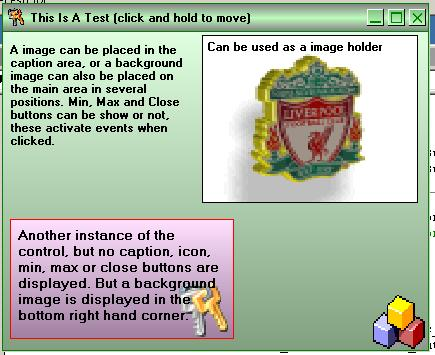



## Form Skinner/Frame Control

### Description

Owner drawn to skin a form or draw a frame. Can show min, max and close buttons.
 
### More Info
 

             |
---                |---
**Submitted On**   |2003-11-23 00:00:00
**By**             |[Hydro\.H20](https://github.com/Planet-Source-Code/PSCIndex/blob/master/ByAuthor/hydro-h20.md)
**Level**          |Intermediate
**User Rating**    |5.0 (15 globes from 3 users)
**Compatibility**  |VB 5\.0, VB 6\.0
**Category**       |[Custom Controls/ Forms/  Menus](https://github.com/Planet-Source-Code/PSCIndex/blob/master/ByCategory/custom-controls-forms-menus__1-4.md)
**World**          |[Visual Basic](https://github.com/Planet-Source-Code/PSCIndex/blob/master/ByWorld/visual-basic.md)
**Archive File**   |[Form\_Skinn2055613232007\.zip](https://github.com/Planet-Source-Code/hydro-h20-form-skinner-frame-control__1-68202/archive/master.zip)

